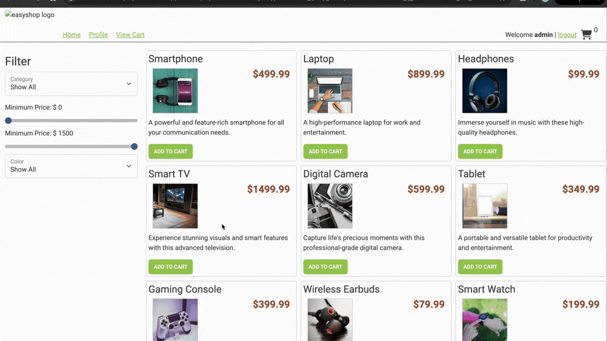

# Project Title
Easy Shop
## Description of the Project
Easy Shop is the back end API that that makes an online store. Users can browse products, search using filters, manage
a shopping cart, and securely access features based on their role. The project uses Spring Boot, Spring Security, Spring Data JPA,
MySQL, JUnit, and Mockito to demonstrate REST API development, database integration, authentication, and automated testing.

## User Stories
- As an administrator, I want to create, update, and delete product categories so that products remain organized.
- As a customer, I want product searches to return all matching products so I can browse every available item.
- As an administrator, I want product updates to save every field so inventory information stays accurate.
- As a customer, I want to manage my shopping cart so I can prepare my order before checkout.
- As a system administrator, I want sensitive endpoints secured so unauthorized users cannot modify data.

## Setup
1. Open IntelliJ IDEA
2. Open the Concert Tracker project
3. Locate the ECommerceApplication.java file
4. Right-click the file and select Run 'ECommerceApplication.main()'

### Prerequisites

- IntelliJ IDEA: Ensure you have IntelliJ IDEA installed, which you can download from [here](https://www.jetbrains.com/idea/download/).
- Java SDK: Make sure Java SDK is installed and configured in IntelliJ.

### Running the Application in IntelliJ

Follow these steps to get your application running within IntelliJ IDEA:

1. Open IntelliJ IDEA.
2. Select "Open" and navigate to the directory where you cloned or downloaded the project.
3. After the project opens, wait for IntelliJ to index the files and set up the project.
4. Find the main class with the `public static void main(String[] args)` method.
5. Right-click on the file and select 'Run 'YourMainClassName.main()'' to start the application.

## Technologies Used

- Java: JDK 17
- IntelliJ IDEA
- Git/GitHub

## Front-End Demo

## Insomnia Demo

## Future Work
- If I had more time I would finish the other phases like user profile and Checkout

## Resources
- [Raymond GitHub](https://github.com/RayMaroun)
- [Java Visual Learning Hub](https://raymaroun.github.io/yearup-java-visuals/)

## Thanks
- Thank you to Raymond for continuous support and guidance.
 